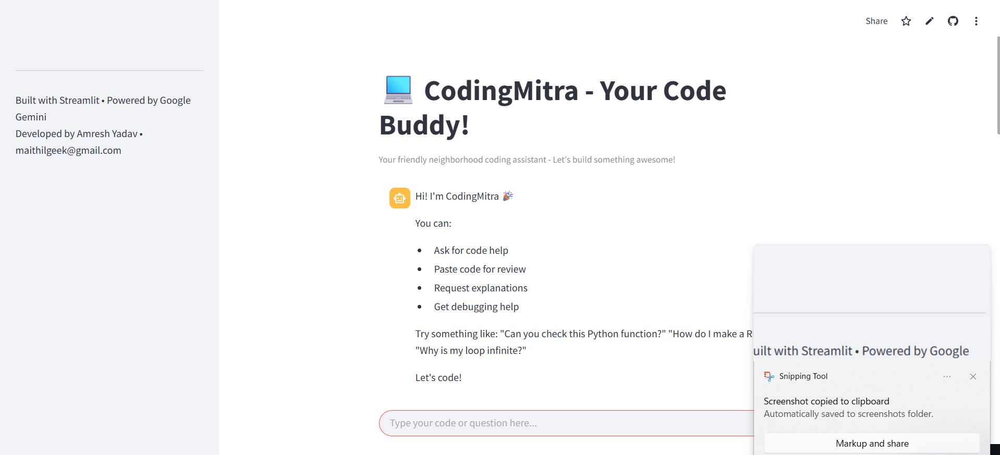

# 💻 CodeMitra – Your AI Code Buddy

[](https://codingmitra-g8oanbdcqcijlqtg6spbbj.streamlit.app/)

CodeMitra is your friendly neighborhood coding assistant built with 🧠 Google Gemini + ⚡ Streamlit.  
It helps you analyze, explain, debug, and generate code naturally – like talking to a coding buddy.

🚀 [Click here to try CodeMitra live!](https://codingmitra-g8oanbdcqcijlqtg6spbbj.streamlit.app/)


[](https://streamlit.io)  
[](https://python.org)  

 *(Add screenshot after deployment)*

## 🌟 Features
- **Natural Language Processing** - Understands coding requests in plain English
- **Four Core Functions**:
  - 🔍 **Code Analysis** - Detailed feedback on structure, performance, and security
  - ✨ **Code Generation** - Production-ready snippets from descriptions
  - 📚 **Code Explanation** - Junior-friendly breakdowns
  - 🐞 **Debugging Assistant** - Error diagnosis with fixes
- **Conversational UI** with chat history
- **Multi-language Support** (Python, JavaScript, Go, etc.)

## 🛠️ Tech Stack
- **Frontend**: Streamlit
- **AI Backend**: Google Gemini 1.5 Flash
- **Deployment**: Vercel
- **Security**: API keys via Streamlit secrets

## 🚀 Quick Start

### Prerequisites
- Python 3.9+
- Streamlit (`pip install streamlit`)
- Google Gemini API key

### Installation
```bash
git clone https://github.com/yourusername/coding-mitra.git
cd coding-mitra
pip install -r requirements.txt
